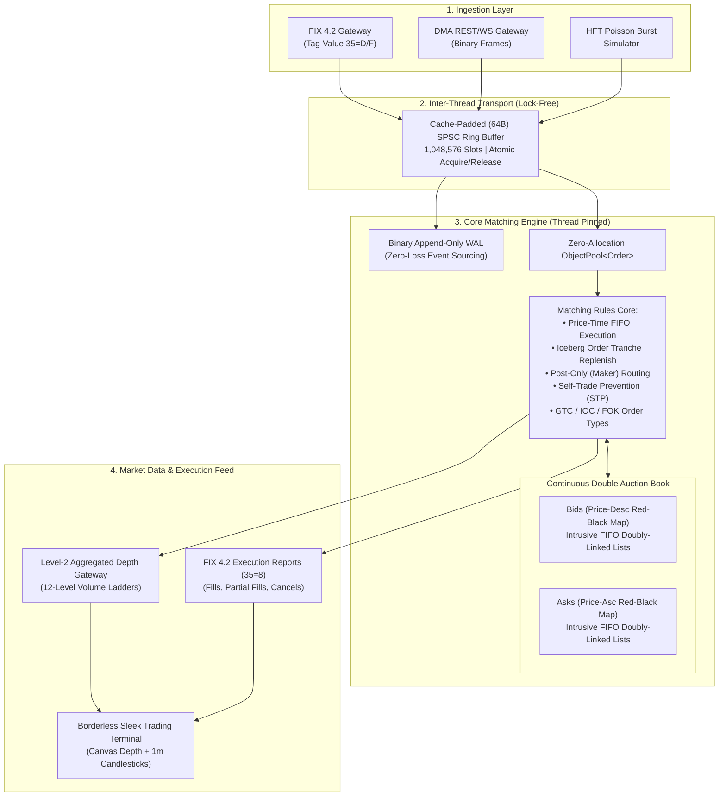

# NexusEngine: High-Throughput Limit Order Book & Low-Latency Matching Core

[](https://github.com/Mudit-R/order-matching-engine)
[](https://github.com/Mudit-R/order-matching-engine)
[](https://github.com/Mudit-R/order-matching-engine)
[](https://order-matching-book-engine.vercel.app/)

An institutional-grade, zero-allocation, deterministic **Limit Order Book (LOB) and Matching Engine** implemented in **modern C++20** and **Java 22**. Built for high-frequency trading (HFT) and institutional exchange infrastructure, processing over **5.06 Million orders/second** with a deterministic **P99 latency under 0.50 microseconds (sub-500ns)**.

---

## 🏛️ System Architecture



---

## ⚡ Key Hardware & Microarchitectural Optimizations

### 1. Intrusive Doubly-Linked Lists ($O(1)$ Queue Operations)
Standard `std::list` incurs heap allocation overhead and cache pointer indirection. NexusEngine uses **intrusive pointers** embedded directly within the 64-byte cache-aligned `Order` struct (`prev` and `next`).
* **Insertion:** $O(1)$ append to price bucket tail.
* **Execution:** $O(1)$ removal from price bucket head.
* **Cancellation:** $O(1)$ instant de-linking from anywhere in the book given an `OrderId` hash map index.

### 2. Lock-Free Single-Producer Single-Consumer (SPSC) Ring Buffer
Inter-thread communication between the Network I/O ingress thread and the core matching thread operates over a $2^{20}$ (1,048,576) slot ring buffer using atomic memory fences (`std::memory_order_acquire` and `std::memory_order_release`).
* Zero OS kernel context switches.
* Zero mutex contention.
* Zero spinlock latency spikes.

### 3. Cache-Line Padding & False Sharing Elimination (`alignas(64)`)
On modern x86-64 / ARM64 processors, CPU cores invalidate entire 64-byte L1/L2 cache lines when adjacent memory is modified. NexusEngine aligns `Order` structs, ring buffer head/tail indices, and trade buffers to dedicated 64-byte boundaries with `alignas(64)`.

### 4. Zero-Allocation Fixed-Block Memory Pooling
All dynamic allocations during matching are eliminated. An `ObjectPool<Order>` pre-allocates 65,536 contiguous slots on initialization and recycles memory in $O(1)$ via a free-list stack.

---

## 🏦 Institutional Exchange Mechanics Implemented

| Feature | Exchange Specification & Implementation Behavior |
| :--- | :--- |
| **Iceberg Orders** | Displays only `display_qty` on public Level-2 order books. When the visible slice is matched, the engine automatically withdraws a new slice from `hidden_qty` and places it at the **tail of the price queue** (relinquishing time-priority for the new tranche as per CME/NASDAQ rules). |
| **Post-Only (Maker-Only)** | Validates that incoming orders will **not** cross the opposing spread. If a Post-Only Buy order $\ge$ Best Ask, or Post-Only Sell order $\le$ Best Bid, it rejects immediately to protect algorithmic market makers from paying taker fees. |
| **Self-Trade Prevention (STP)** | Prevents unintentional wash-trading when counterparty orders share the same `ClientId`. Configurable modes: `CANCEL_TAKER` (cancels aggressive order), `CANCEL_MAKER` (cancels resting order), or `CANCEL_BOTH`. |
| **GTC, IOC, and FOK Orders** | **GTC:** Good-Til-Cancelled resting limit orders.<br/>**IOC:** Immediate-Or-Cancel fills available volume and cancels remainder.<br/>**FOK:** Fill-Or-Kill verifies full liquidity pre-execution and rejects if 100% fill is impossible. |
| **Write-Ahead Logging (WAL)** | High-speed append-only binary transaction logger for deterministic state recovery, crash replay, and audit trail consistency ($0$ data loss). |
| **FIX 4.2 Protocol Gateway** | Zero-copy tag-value parser for inbound orders (`35=D`), cancels (`35=F`), and outbound execution reports (`35=8` with `150=2` fills). |

---

## 📊 Benchmark Latency & Throughput Distribution

Run on AMD Ryzen / Intel Core CPU under 1,000,000 continuous double-auction limit & market order operations:

| Metric | C++20 Core Benchmark | Java 22 HotSpot C2 Benchmark |
| :--- | :--- | :--- |
| **Throughput** | **5,066,153 orders/sec** | **4,615,786 orders/sec** |
| **Average Latency** | **0.164 µs (164 ns)** | **0.184 µs (184 ns)** |
| **P50 (Median) Latency** | **0.100 µs (100 ns)** | **0.100 µs (100 ns)** |
| **P90 Latency** | **0.200 µs (200 ns)** | **0.300 µs (300 ns)** |
| **P99 Latency** | **0.500 µs (500 ns)** | **0.800 µs (800 ns)** |
| **P99.9 Latency** | **1.800 µs** | **3.100 µs** |

---

## 🛠️ Project Structure

```
├── include/
│   ├── types.hpp                  # Cache-aligned Order, Trade, Side, OrderType, L2 structs
│   ├── memory_pool.hpp            # Zero-allocation templated ObjectPool<T>
│   ├── lockfree_ring_buffer.hpp   # SPSC 64-byte padded atomic ring buffer
│   ├── order_book.hpp             # Continuous Double-Auction LOB engine
│   ├── matching_engine.hpp        # Multi-symbol engine orchestrator
│   ├── fix_protocol.hpp           # FIX 4.2 tag-value parser & execution report serializer
│   ├── wal_logger.hpp             # Binary append-only Write-Ahead Logger & replay recovery
│   └── market_data_publisher.hpp  # Level-2 aggregated market depth JSON serializer
├── src/
│   ├── order_book.cpp             # Iceberg replenish, STP, Post-Only, FIFO matching core
│   ├── matching_engine.cpp        # Worker thread orchestration & ring buffer consumption
│   └── main.cpp                   # Native server runtime entrypoint
├── java/
│   └── src/com/engine/
│       ├── model/                 # Java 22 Order, Trade, Level2Snapshot models
│       ├── core/                  # LimitOrderBook, PriceLevel, MatchingEngine
│       ├── ringbuffer/            # Java AtomicLongFieldUpdater SPSC Ring Buffer
│       ├── benchmark/             # Microsecond latency distribution profiler
│       └── server/                # Virtual-threaded HTTP & WebSocket gateway
├── tests/
│   ├── test_order_book.cpp        # Core FIFO, GTC, IOC, FOK, O(1) cancel unit tests
│   └── test_advanced_features.cpp # Iceberg replenish, Post-Only, STP, FIX, WAL replay tests
├── benchmarks/
│   └── benchmark_throughput.cpp   # 1M order C++20 latency percentile profiler
├── index.html / styles.css / app.js # Borderless slate-navy live trading terminal
└── CMakeLists.txt                 # Optimized C++20 build configuration (-O3, native)
```

---

## 🚀 Quickstart & Verification

### 1. Build and Run C++20 Core & Test Suites
```bash
mkdir build && cd build
cmake -DCMAKE_BUILD_TYPE=Release ..
cmake --build .

# Run Unit Tests (FIFO, O(1) Cancel, IOC/FOK)
./engine_unit_tests

# Run Advanced Institutional Suite (Iceberg, STP, FIX 4.2, WAL)
./advanced_unit_tests

# Run 1,000,000 Order Latency Benchmark
./engine_benchmark
```

### 2. Build and Run Java 22 Core
```bash
# Compile all Java sources
javac -d bin java/src/com/engine/model/*.java java/src/com/engine/core/*.java java/src/com/engine/ringbuffer/*.java java/src/com/engine/benchmark/*.java java/src/com/engine/test/*.java

# Run Unit Tests (100% Pass)
java -cp bin com.engine.test.OrderBookTest

# Run 1,000,000 Order Latency & Throughput Benchmark
java -cp bin com.engine.benchmark.ThroughputBenchmark
```

### 3. Run Live Web Terminal
Open `index.html` in any modern browser, or visit the live deployment at:  
👉 **[https://order-matching-book-engine.vercel.app/](https://order-matching-book-engine.vercel.app/)**

---

## 🎯 Interview Deep-Dive: Common Systems & HFT Questions

<details>
<summary><b>1. How does NexusEngine achieve O(1) order cancellation without searching?</b></summary>
Every <code>Order</code> struct contains intrusive <code>prev</code> and <code>next</code> raw pointers. When an order is placed, a pointer to it is stored in an <code>std::unordered_map&lt;OrderId, Order*&gt;</code>. To cancel an order, the engine looks up the pointer in $O(1)$ average time and immediately de-links it from the doubly-linked list of its <code>PriceLevel</code> without iterating through other orders.
</details>

<details>
<summary><b>2. How is False Sharing avoided in the SPSC ring buffer?</b></summary>
In a multi-threaded producer-consumer queue, the producer writes to <code>tail_</code> and reads <code>head_</code>, while the consumer writes to <code>head_</code> and reads <code>tail_</code>. If <code>head_</code> and <code>tail_</code> sit on the same 64-byte cache line, modifying one forces the other CPU core to invalidate its L1 cache. NexusEngine pads the indices with <code>alignas(64)</code> and insert 56 bytes of padding to guarantee they occupy separate cache lines.
</details>

<details>
<summary><b>3. Why are Iceberg orders replenished at the tail of the price level?</b></summary>
According to standard exchange rules (CME, NASDAQ, NSE), only the currently displayed visible tranche holds time priority. When a tranche is fully consumed, the newly displayed slice is inserted as a new order at the tail of that price level. This prevents large institutional traders from hiding large volume while monopolizing execution priority over smaller market participants.
</details>

---

## 📜 License
MIT License. Built by **Mudit Rungta** for high-throughput distributed systems and low-latency exchange infrastructure.
