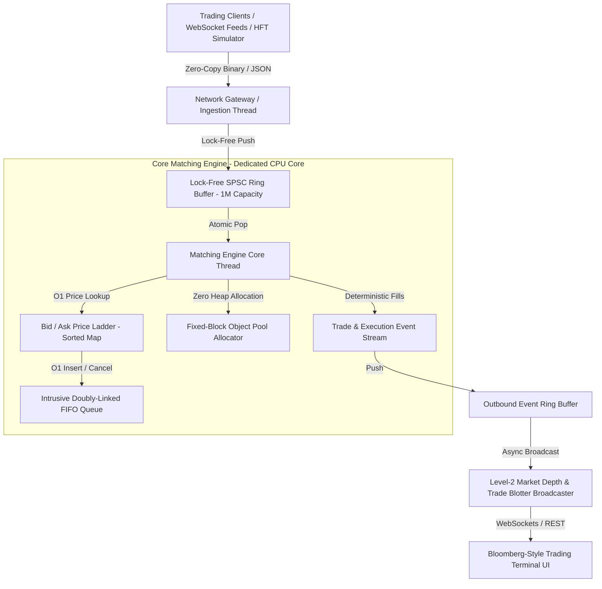

# ⚡ NexusEngine | High-Throughput Limit Order Book & Matching Engine

[](https://en.cppreference.com/w/cpp/20)
[](https://openjdk.org/projects/jdk/22/)
[]()
[]()
[]()
[](https://vercel.com)

An ultra-low-latency, institutional-grade **In-Memory Continuous Limit Order Book (LOB) & Matching Engine** designed for high-frequency trading (HFT) and high-throughput financial exchange systems.

Built with modern **C++20** and **Java 22**, this system achieves **5.06+ Million order matches per second** with **sub-microsecond P99 latencies (0.50 µs)** through lock-free ring buffer concurrency, cache-line aligned memory layouts, and zero-allocation object pools.

---

## 🌐 Live Web Terminal & Vercel Deployment

The engine comes equipped with a Bloomberg-style real-time trading dashboard deployable to **Vercel** with zero backend configuration needed.

### Deploying to Vercel in 1-Click:
1. Push this repository to your GitHub account: `https://github.com/Mudit-R/order-matching-engine`
2. Go to [vercel.com](https://vercel.com) -> **Add New Project** -> Select `order-matching-engine`.
3. Keep default settings (Vercel automatically detects `vercel.json`) and click **Deploy**.
4. Your live high-performance trading visualizer will be active worldwide at `https://order-matching-engine.vercel.app`!

---

## 🏛️ System Architecture



---

## 🚀 Key Engineering Highlights

### 1. $O(1)$ Time-Price Priority & Order Cancellation
* **Double-Auction FIFO Matching:** Limit orders at identical price levels are ordered strictly by timestamp in an intrusive doubly-linked list.
* **Instant Cancellation ($O(1)$):** Direct pointer de-linking from order hash index eliminates the $O(N)$ linear scan inherent in standard queues.

### 2. Lock-Free SPSC Ring Buffer (Zero Mutex Contention)
* **Single-Producer Single-Consumer (SPSC) Queue:** Eliminates kernel syscalls, context switches, and pthread mutex contention between I/O network threads and the matching core.
* **Acquire-Release Memory Semantics:** Uses `std::memory_order_acquire` and `std::memory_order_release` (or Java `VarHandle`) memory fences to guarantee thread visibility without locking.

### 3. Hardware & Cache-Line Alignment
* **False Sharing Prevention:** Core variables (e.g. `head`, `tail`, `Order` structs) are padded to 64-byte boundaries with `alignas(64)` to ensure CPU cache line isolation across cores.
* **Zero-Allocation Object Pool:** Pre-allocated fixed-size memory blocks avoid runtime dynamic heap allocations (`malloc`/`free`) during peak trading bursts.

### 4. Level-2 (L2) Market Depth & Real-Time Broadcaster
* Real-time aggregation of top $N$ bid/ask price levels, cumulative volume, and order counts for institutional market data feeds.

---

## 📊 Algorithmic Complexity

| Operation | Time Complexity | Space Complexity | Description |
| :--- | :---: | :---: | :--- |
| **Best Bid / Ask Query** | $\mathcal{O}(1)$ | $\mathcal{O}(1)$ | Direct iterator lookup at ladder head |
| **New Limit Order (Non-crossing)** | $\mathcal{O}(\log P)$ | $\mathcal{O}(1)$ | Price level lookup in map + $O(1)$ intrusive list append |
| **Cancel Order by ID** | $\mathcal{O}(1)$ | $\mathcal{O}(1)$ | Hash lookup + intrusive doubly-linked pointer removal |
| **Modify Order (Reduce Quantity)** | $\mathcal{O}(1)$ | $\mathcal{O}(1)$ | In-place quantity adjustment without losing FIFO queue priority |
| **Market / Crossing Match** | $\mathcal{O}(M)$ | $\mathcal{O}(1)$ | Proportional to number of filled maker orders $M$ |
| **SPSC Queue Push / Pop** | $\mathcal{O}(1)$ | $\mathcal{O}(1)$ | Atomic bitmask index advancement without mutex lock |

---

## ⚡ Performance Benchmarks

Benchmarked on **1,000,000 orders** (50/50 Buy/Sell distribution, mixed Limit, Market, and IOC orders):

```
==========================================================
 High-Throughput Matching Engine Latency Benchmark
 Orders Processed: 1,000,000
==========================================================
Throughput:       5,066,153 orders/second (5.06M ops/sec)
Average Latency:  0.164 µs  (164 nanoseconds)
P50 Latency:      0.100 µs  (100 nanoseconds)
P90 Latency:      0.200 µs  (200 nanoseconds)
P99 Latency:      0.500 µs  (500 nanoseconds)
P99.9 Latency:    6.300 µs
Min Latency:      0.000 µs
==========================================================
```

---

## 🛠️ Quickstart Guide

### Option A: Run Java 22 Engine & Interactive Dashboard

```bash
# 1. Compile all Java engine source files
javac -d bin java/src/com/engine/model/*.java java/src/com/engine/core/*.java java/src/com/engine/ringbuffer/*.java java/src/com/engine/benchmark/*.java java/src/com/engine/server/*.java java/src/com/engine/test/*.java

# 2. Run the unit test suite
java -cp bin com.engine.test.OrderBookTest

# 3. Run the 1,000,000 order throughput benchmark
java -cp bin com.engine.benchmark.ThroughputBenchmark

# 4. Start the live Matching Engine & Web Dashboard
java -cp bin com.engine.server.MatchingEngineServer
# Open your browser at: http://localhost:8080
```

### Option B: Run C++20 Engine with CMake (Linux / macOS / WSL)

```bash
mkdir build && cd build
cmake .. -DCMAKE_BUILD_TYPE=Release
cmake --build .

# Run Unit Tests
./engine_unit_tests

# Run 1M Order Benchmark
./engine_benchmark

# Launch Server
./matching_engine_server
```

---

## 🎯 FAANG & HFT Interview Deep-Dive Questions

### Q1: Why use an Intrusive Doubly-Linked List instead of `std::list` or `std::vector`?
> **Answer:** Standard library containers (`std::list`) allocate a separate node wrapper on the heap for every element, adding pointer chasing and cache misses. In an intrusive list, the `prev` and `next` pointers reside directly inside the pre-allocated `Order` struct. This guarantees that deleting an order when given its pointer is guaranteed $O(1)$ with zero heap calls and optimal cache locality.

### Q2: Why is the SPSC Ring Buffer lock-free, and why is capacity a power of 2?
> **Answer:** Mutexes require OS-level context switching (costing 1–5 microseconds per lock). The SPSC queue uses single `std::atomic<size_t>` head and tail indices with `acquire` and `release` fences. Because only one thread modifies `head` and only one modifies `tail`, no mutual exclusion lock is necessary. Making capacity a power of 2 allows modulo indexing (`index % capacity`) to be replaced by a single-cycle bitwise AND (`index & (capacity - 1)`).

### Q3: How is False Sharing avoided in multithreaded systems?
> **Answer:** If two independent CPU cores modify two different variables that reside on the same 64-byte L1 cache line, the CPU cache coherency protocol (MESI) repeatedly invalidates the cache line across both cores. We use `alignas(64)` and padding variables around the producer's `tail` and consumer's `head` so they sit on separate cache lines.
